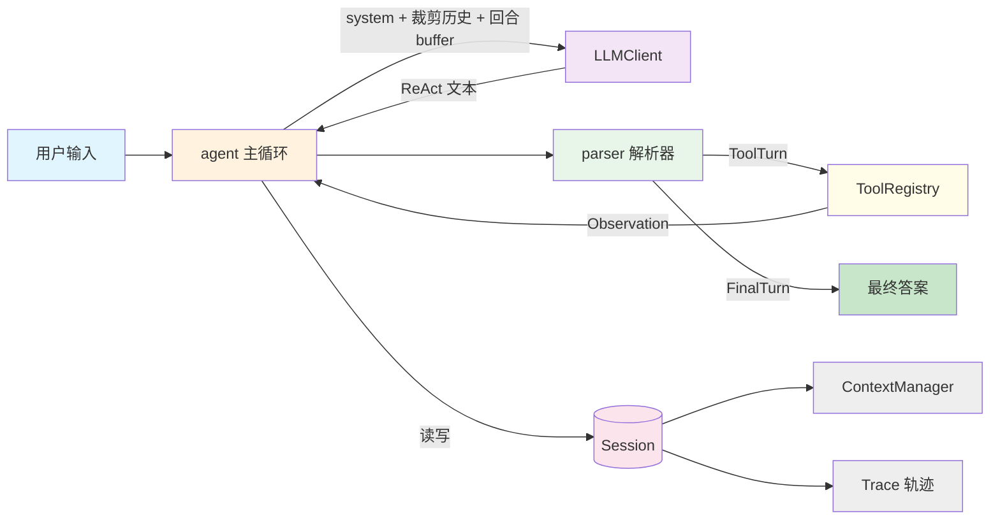

# agent-runtime

从零实现的 AI Agent Runtime 核心系统：不依赖 LangGraph / OpenHands 等任何现成 Agent 框架，自行实现循环控制、工具调度、上下文管理与 Session 管理。

## 运行方式

### 1. 安装依赖

```bash
pip install -r requirements.txt
```

### 2. 配置 `.env`

在项目根目录创建 `.env`（各模块导入时通过 `load_dotenv()` 自动加载）：

| 变量 | 用途 | 必填 |
|---|---|---|
| `LLM_BASE_URL` | OpenAI 兼容端点，如 DeepSeek / Qwen / Ollama | ✓ |
| `LLM_MODEL` | 模型名 | ✓ |
| `LLM_API_KEY` | API 密钥；本地端点（如 Ollama）可留空 | 视端点 |
| `TAVILY_API_KEY` | 联网搜索（https://tavily.com 免费申请） | 用 search 时 |
| `QWEATHER_API_KEY` | 天气查询（https://dev.qweather.com 免费订阅 1000 次/天） | 用 weather 时 |
| `QWEATHER_API_HOST` | dev 订阅改为 `devapi.qweather.com` | 可选 |

key 未配置时工具调用会返回明确的错误提示（喂回模型自行解释），不会静默失败。

### 3. 启动对话

```bash
python app.py                  # 新建会话，启动时打印 session id
python app.py -s <session id>  # 恢复指定会话，接着上次聊
```

- 多轮对话，输入 `/exit` 或 `/quit` 退出
- 每回合成功后自动把历史落盘到 `sessions/<id>.json`，退出不丢；traces 轨迹不持久化
- 用户输入、Agent 回复、LLM 调用、工具调用都会写入 `logs/agent.log`（DEBUG 级完整调用链，可用 `session id` 串联同一会话的日志；`sessions/` 目录文件名即会话 id）

### 4. 运行测试

```bash
python -m pytest -q  # 110 个测试，全部离线可跑；测试日志写入 logs/test.log，不污染 logs/agent.log
```

## 系统设计



| 模块 | 职责 |
|---|---|
| `agent.py` | ReAct 主循环：拼接请求、解析输出、执行工具、回合原子性提交 |
| `parser.py` | 文本协议解析器（Thought / Action / Final Answer） |
| `tools.py` + `_tools/` | 工具注册表、迷你 JSON-Schema 校验器、内置工具（calculator / Tavily 搜索 / QWeather 天气） |
| `context.py` | Message 模型、回合切分与滑动窗口裁剪（即 Memory，见下节） |
| `session.py` | 多 Session 隔离与切换、会话 JSON 持久化与恢复 |
| `llm.py` + `testing.py` | openai SDK 客户端（含推理模型 reasoning_content 兜底）与脚本化 Fake LLM |
| `trace.py` | 每次 LLM / 工具调用的轨迹记录与 rich 渲染 |

### Agent 工作循环

system prompt 规定模型按「思考 → 调用工具 → 观察结果 → 再思考」循环工作：每轮输出 `Action` 后，系统执行工具并把返回内容以 `Observation: 结果` 的形式交还模型；模型据此继续下一轮，直到信息足够输出 `Final Answer`。协议约束：每轮只调用一个工具、不得虚构工具与参数、不得编造工具返回结果、信息不足时继续调用而不是猜测。

循环终止条件：解析出 `Final Answer`；最多 `max_steps` 步（默认 8）兜底熔断。

### 输出协议

模型每轮输出以下两种格式之一：

```
# 格式一：需要调用工具
Thought: 一句话说明当前判断和调用该工具的目的
Action: 工具名
Action Input: {"参数名": "参数值"}

# 格式二：已有足够信息回答
Thought: 一句话
Final Answer: 用与用户相同的语言，给出准确、完整的最终答复
```

### 内置工具

| 工具 | 参数 | 说明 |
|---|---|---|
| `calculator` | `expression`（必填） | AST 白名单安全求值：四则运算、幂、取模、常量 pi/e，拒绝函数调用与过大的幂指数 |
| `search` | `query`（必填） | Tavily 联网搜索，最多 5 条结果，输出标题/链接/摘要（2000 字上限） |
| `weather` | `city`（必填）、`date`（可选） | QWeather 天气：不给 `date` 查实时天气，给 `date` 查 3 天内预报（城市名自动解析为 location id） |

### 异常处理策略

| 场景 | 处理 |
|---|---|
| 工具执行失败 / 未知工具 / 参数非法 | 转成 `Error: ...` 观察喂回模型自主纠错，每步消耗 max_steps 预算 |
| LLM 输出无法解析 | 有限重试（默认 2 次），失败原因原样反馈；超限抛 `ParseError` |
| LLM API 失败 | 不自动重试，直接抛 `LLMError`（回合原子性保证可安全重跑） |
| 超步数未产出答案 | 抛 `MaxIterationsExceeded` |

**回合原子性**：整回合成功后一次性提交进历史；任何异常丢弃回合 buffer，历史保持回合前原状。

## Memory：召回时机与放置方式

Memory 指会话内的上下文管理（`context.py` 的 `ContextManager`），决定**哪些内容放进上下文（放置）**、**何时放进 / 何时丢弃（召回）**。它是会话级内存，跨进程靠 `sessions/*.json` 落盘恢复，不跨 Session 共享。

### 放置方式

**进 Memory 的**：

1. **system 提示**（每次请求重新生成，永不裁剪）：身份与工作方式、当天日期（`今天是 YYYY-MM-DD`，使「明天/后天」类追问对模型可计算）、ReAct 输出协议、工具 Schema 清单。
2. **用户原始输入**与 **assistant 原始 ReAct 文本**——选原始文本而非摘要的理由：解析纠错、模型回顾推理链、测试断言都依赖逐字内容；压缩是丢失性操作，只应在必须发生的长度边界做，而不是每轮。
3. **工具观察**（`Observation: ...` 前缀，伪装成 user 角色，因为多数 OpenAI 兼容端点不支持 tool role）。
4. **最终答复原文**。

**不进 Memory 的**：trace 事件（诊断性，另存 Session.traces）；失败回合的解析重试反馈（回合级 buffer，失败即丢弃）。

### 召回时机

1. **每次 LLM 请求实时组装**：`system + session.history.trim() + 当前回合 buffer`。历史只在整回合成功提交后才进入 Memory（回合原子性的唯一入口 `_commit`）。
2. **回合切分规则**：以「不以 `Observation:` / `Error:` 开头的 user 消息」作为新回合起点，其后到下一回合起点前的全部消息属于同一回合。裁剪只按整回合丢弃，不会把一次工具调用拆成两半。
3. **裁剪是视图，不是删除**：`trim()` 只影响本次请求看到的内容，完整历史仍在 Session 中；`trim_stats` 记录最近一次裁剪统计（丢弃回合数、截断条数、丢弃字符数）。
4. **跨进程召回**：每回合成功后历史落盘 `sessions/<id>.json`；重启后 `app.py -s <id>` 读回历史继续对话。

### 截断策略（滑动窗口）

| 层级 | 规则 |
|---|---|
| 回合数上限 | 自后向前保留最多 `max_turns` 个完整回合（默认 6），超出的最老整回合丢弃 |
| 字符数上限 | 总长超 `max_chars`（默认 8000）时继续整回合丢弃最老端 |
| 最坏情况硬截断 | 只剩一个回合仍超长时，对最老消息逐条截断，保留头部 300 字并标记 `…[已截断 N 字]` |
| 单条观察上限 | 工具观察单条最多 2000 字符（agent 层 `OBSERVATION_LIMIT`，超长截断加省略标记） |

两项上限可在创建 Session 时按需调整：`Session(max_turns=..., max_chars=...)`。
